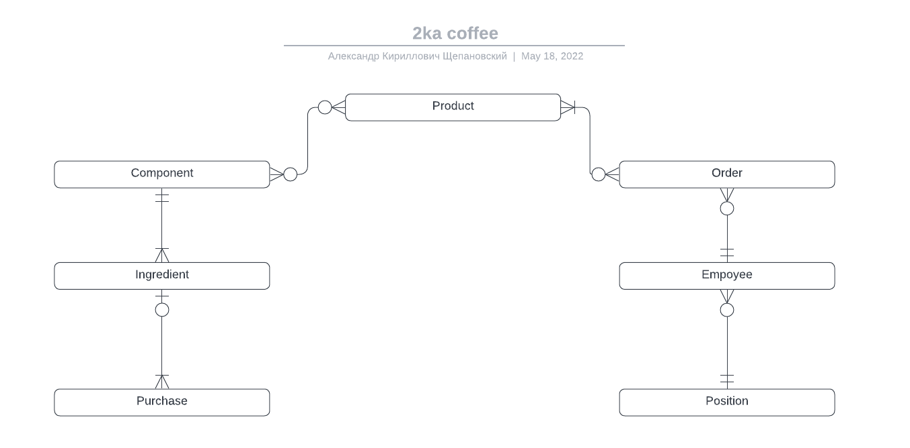
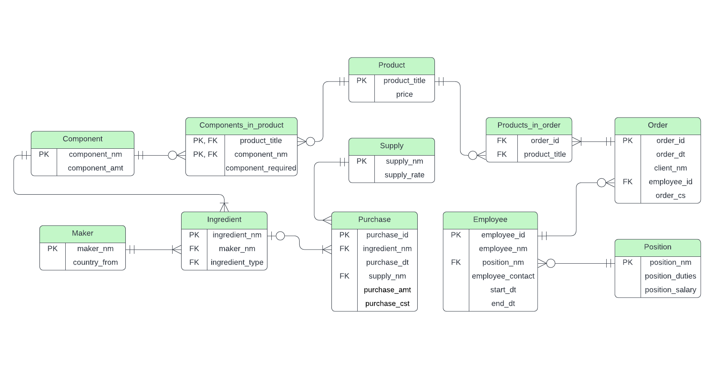

# Проект по курсу "Базы данных"

## Описание проекта

### Выбранная тема

Кофейня во 2-м общежития МФТИ

### Мотивация

Полезное применение в реальной жизни
Непосредственная вовлечённость

### Применение

Структуризация данных
Оптимизация производства и закупок
Отслеживание трендов

### Предисловие

Предположим, юный предприниматель 2-го курса ФИВТа Арсений Беляев, очень любящий пить кофе, возмутился ценам на данный напиток и решил, дабы вернуть хоть часть средств, вложенных в зёрна из Эфиопии, открыть собственную кофейню, и, чтобы экономить на аренде помещения, реализовал эту, на первый взгляд безупречную идею, в собственной комнате во втором общежитии МФТИ.
Благодаря находчивости Арсения, бизнес быстро развивался и, чтобы оптимизировать производство и отслеживать тренды, ему понадобилась база данных

## Проектирование

### Концептуальная модель

### Логическая модель

### Физическая модель

.

## Создание и заполнение БД, CRUD

Выбранная СУБД - `PostgreSQL`

Инструкции в языке `SQL` делятся на несколько типов. Прежде всего потребуется `Data Definition Language`: с помощью `create`-запросов мы создаём и описываем отношения, которые присутствуют в базе данных. **[Код](./scripts/initialize.sql)**

Далее воспользуемся `Data Manipulation Language`. На этом шаге с помощью `insert`-запросов описанные выше отношения заполняются данными, чтобы в дальнейшем с ними можно было работать. **[Код](./scripts/insertion.sql)**

## Дополнительно

### CRUD

CRUD — акроним, обозначающий четыре базовые функции, используемые при работе с базами данных: создание (create), чтение (read), модификация (update), удаление (delete). Введён Джеймсом Мартином в 1983 году как стандартная классификация функций по манипуляции данными. **[Код](./scripts/crud.sql)**

### Версионность

Таблица `employee` является версионной, так как сотрудники могут увольняться, может изменяться их зарплата или должность. Для каждого работника храним дополнительно временной промежуток, внутри которого информация о сотруднике является (являлась) актуальной. Версионность достигается путём использования `SCD 2`

## Работа с Базой Данных

**[Создание select-запросов](./scripts/select.sql)**

**[Создание представлений(view)](./scripts/views.sql)**

**[Создание индексов](./scripts/indexes.sql)**

**[Создание процедур и триггеров](./scripts/procedures_triggers.sql)**

